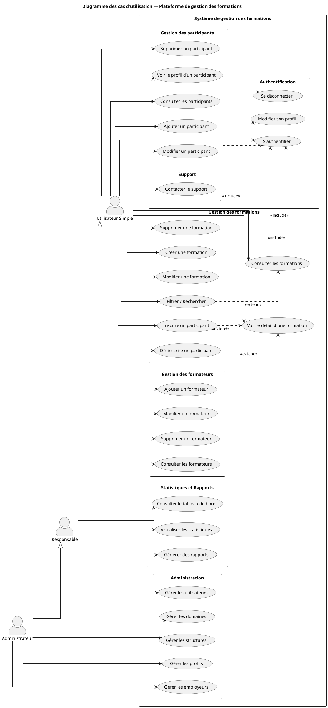

# Rapport de Projet — Plateforme de Gestion des Formations

## 1. Présentation générale

L'application est une plateforme web de gestion des formations professionnelles permettant l'organisation des sessions de formation, la gestion des formateurs, des participants et le suivi statistique. Elle adopte une architecture client-serveur découplée :

- **Frontend** : application Angular (SPA) servie au navigateur.
- **Backend** : API REST Spring Boot exposant les ressources métier.
- **Base de données** : PostgreSQL.
- **Authentification** : JWT (stateless) avec rôles applicatifs.

L'application gère trois rôles : `SIMPLE_UTILISATEUR`, `RESPONSABLE` et `ADMINISTRATEUR`, chacun disposant de droits d'accès différenciés sur les modules.

---

## 2. Technologies utilisées

### 2.1. Frontend

| Catégorie | Technologie | Version |
|---|---|---|
| Framework | Angular | 21.2 |
| Langage | TypeScript | 5.9 |
| Réactivité | RxJS + Signals Angular | 7.8 |
| Style | Tailwind CSS | 4.1 |
| Graphiques | Chart.js | 4.5 |
| Tests | Vitest + jsdom | 4.0 |
| Build | Angular CLI / @angular/build | 21.2 |

### 2.2. Backend

| Catégorie | Technologie | Version |
|---|---|---|
| Framework | Spring Boot | 4.0.5 |
| Langage | Java | 17 |
| Sécurité | Spring Security + JWT (jjwt) | 0.12.3 |
| Persistance | Spring Data JPA / Hibernate | — |
| Mapping DTO | MapStruct | 1.5.5 |
| Validation | Jakarta Bean Validation | — |
| Documentation API | SpringDoc OpenAPI (Swagger) | 3.0.2 |
| SGBD | PostgreSQL | — |

### 2.3. Outils

- **Gestionnaire de paquets** : npm (frontend), Maven (backend)
- **Versioning** : Git
- **IDE** : Visual Studio Code, IntelliJ IDEA

---

## 3. Structure des fichiers

### 3.1. Frontend (`FrontAngular/`)

```
FrontAngular/
├── src/
│   ├── app/
│   │   ├── auth/                         # Authentification
│   │   │   └── components/
│   │   │       ├── login/                # Page de connexion
│   │   │       ├── unauthorized/         # Page d'accès refusé
│   │   │       └── user-management/      # Gestion compte utilisateur
│   │   │
│   │   ├── core/                         # Couche transverse
│   │   │   ├── config/                   # menu.config.ts, settings.config.ts
│   │   │   ├── guards/                   # Guards de routes (auth, roles)
│   │   │   ├── interceptors/             # Intercepteurs HTTP (JWT)
│   │   │   └── services/                 # Services métier (HTTP)
│   │   │       ├── auth.service.ts
│   │   │       ├── formation.service.ts
│   │   │       ├── formateurs.service.ts
│   │   │       ├── participant.service.ts
│   │   │       └── refrence-dat.service.ts
│   │   │
│   │   ├── models/                       # Interfaces TypeScript (DTO)
│   │   │   ├── formationDTO.interface.ts
│   │   │   ├── formateur.interface.ts
│   │   │   ├── participant.interface.ts
│   │   │   ├── domaine.interface.ts
│   │   │   ├── structure.interface.ts
│   │   │   ├── profile.interface.ts
│   │   │   └── employeur.interface.ts
│   │   │
│   │   ├── components/                   # Composants fonctionnels
│   │   │   ├── home/                     # Page d'accueil
│   │   │   │
│   │   │   ├── user/                     # Modules utilisateur
│   │   │   │   ├── manage-formation/
│   │   │   │   │   ├── formation-card/
│   │   │   │   │   ├── formation-modal/
│   │   │   │   │   └── formation-details/
│   │   │   │   ├── manage-formateur/
│   │   │   │   │   ├── formateur-card/
│   │   │   │   │   └── formateur-modal/
│   │   │   │   └── manage-participants/
│   │   │   │       ├── participant-modal/
│   │   │   │       └── profile/
│   │   │   │
│   │   │   ├── responsable/              # Modules responsable
│   │   │   │   ├── dashboard/
│   │   │   │   ├── chart-canvas/
│   │   │   │   └── kpi-card/
│   │   │   │
│   │   │   └── admin/                    # Modules administrateur
│   │   │       ├── manage-users/
│   │   │       │   └── user-modal/
│   │   │       └── configurations/       # Domaines/Structures/Profils/Employeurs
│   │   │           └── config-modal/
│   │   │
│   │   ├── shared/                       # Composants réutilisables
│   │   │   └── components/
│   │   │       ├── layout/               # Layout principal (sidebar, header)
│   │   │       ├── my-table-layout/      # Tableau générique
│   │   │       ├── modal/                # Modal de base
│   │   │       └── contact/              # Formulaire de contact
│   │   │
│   │   ├── app.config.ts                 # Configuration application
│   │   ├── app.routes.ts                 # Définition des routes
│   │   └── app.ts                        # Composant racine
│   │
│   ├── styles.css                        # Styles globaux (Tailwind)
│   ├── index.html
│   └── main.ts
│
├── package.json
├── angular.json
├── tsconfig.json
└── tailwind.config.js
```

### 3.2. Backend (`Backend_MP/`)

```
Backend_MP/
├── src/main/java/com/example/backend_mp/
│   ├── BackendMpApplication.java         # Point d'entrée Spring Boot
│   ├── openApiConfig.java                # Configuration Swagger
│   │
│   ├── entity/                           # Entités JPA
│   │   ├── Utilisateur.java
│   │   ├── Role.java
│   │   ├── Formation.java
│   │   ├── Formateur.java
│   │   ├── Participant.java
│   │   ├── ParticipantFormation.java
│   │   ├── Domaine.java
│   │   ├── Structure.java
│   │   ├── Profil.java
│   │   └── Employeur.java
│   │
│   ├── dto/                              # Objets de transfert
│   ├── repository/                       # Interfaces Spring Data JPA
│   ├── service/                          # Logique métier
│   │
│   ├── web/
│   │   └── controller/                   # Contrôleurs REST
│   │       ├── AuthenticationController.java
│   │       ├── FormationController.java
│   │       ├── FormateurController.java
│   │       ├── ParticipantController.java
│   │       ├── UtilisateurController.java
│   │       └── ReferenceDataController.java
│   │
│   └── security/                         # Filtres JWT, configuration sécurité
│
├── src/main/resources/
│   └── application.properties            # Configuration (BD, JWT, etc.)
│
└── pom.xml                               # Dépendances Maven
```

---

## 4. Diagramme des cas d'utilisation

### 4.1. Acteurs identifiés

- **Utilisateur Simple** (`SIMPLE_UTILISATEUR`) : consulte et gère les formations, formateurs et participants.
- **Responsable** (`RESPONSABLE`) : hérite des droits de l'utilisateur simple et accède aux statistiques et rapports.
- **Administrateur** (`ADMINISTRATEUR`) : hérite des droits du responsable et administre les utilisateurs et la configuration du système.

### 4.2. Code PlantUML (en français)

Le code suivant peut être collé dans un éditeur PlantUML (par exemple https://plantuml.com/plantuml ou l'extension VS Code « PlantUML ») pour générer le diagramme.



### 4.3. Description textuelle

| Cas d'utilisation | Acteurs | Description |
|---|---|---|
| S'authentifier | Tous | Se connecter via login/mot de passe, obtenir un JWT. |
| Consulter / Gérer les formations | Tous | CRUD complet sur les sessions de formation. |
| Inscrire / Désinscrire un participant | Tous | Associer ou retirer un participant à une formation. |
| Consulter / Gérer les formateurs | Tous | CRUD sur les formateurs et leurs disponibilités. |
| Consulter / Gérer les participants | Tous | CRUD sur les participants. |
| Visualiser les statistiques | Responsable, Admin | Tableaux de bord, KPIs, graphiques. |
| Générer des rapports | Responsable, Admin | Export et synthèse des données. |
| Gérer les utilisateurs | Administrateur | Création / modification / suppression des comptes. |
| Gérer la configuration | Administrateur | Domaines, structures, profils, employeurs. |

---

## 5. Diagramme de classes

> *Section à compléter.*

---

## 6. Mise en place (Set up)

### 6.1. Prérequis

- **Java 17+** et **Maven 3.8+** (backend Spring Boot)
- **PostgreSQL 13+** (base de données)
- **Node.js 18+** et **npm** (frontend Angular)
- **Git**

### 6.2. Base de données

```bash
psql -U postgres
```

```sql
CREATE DATABASE training_db;
CREATE USER training_user WITH PASSWORD 'training_password';
GRANT ALL PRIVILEGES ON DATABASE training_db TO training_user;
```

Initialiser le schéma puis charger les données de test :

```bash
psql -U training_user -d training_db -f schema.sql
psql -U training_user -d training_db -f Backend_MP/src/main/resources/seed.sql
```

Le script `seed.sql` est idempotent (`TRUNCATE … RESTART IDENTITY`) et alimente la base sur la période **2021 → 2026 (T2)** : 4 rôles, 25 formateurs, 100 participants, ~90 formations et ~720 inscriptions, afin que les tableaux de bord disposent d'un historique pluriannuel.

### 6.3. Backend (Spring Boot)

Configurer `Backend_MP/src/main/resources/application.properties` (URL JDBC, login, mot de passe, secret JWT), puis :

```bash
cd Backend_MP
mvn clean install -DskipTests
mvn spring-boot:run
```

- API : **http://localhost:8080/api**
- Swagger UI : **http://localhost:8080/api/swagger-ui.html**

### 6.4. Frontend (Angular)

```bash
cd FrontAngular
npm install
npm start          # ou : ng serve
```

Application accessible sur **http://localhost:4200**.

L'URL de l'API est définie dans `src/app/core/config/settings.config.ts` — à adapter si le backend n'est pas sur `http://localhost:8080`.

### 6.5. Comptes de test

| Login           | Mot de passe   | Rôle              |
|-----------------|----------------|-------------------|
| `admin`         | `password123`  | ADMIN             |
| `gestionnaire1` | `password123`  | GESTIONNAIRE      |
| `m.bensalah`    | `password123`  | FORMATEUR         |
| `rh.lecture`    | `password123`  | CONSULTATION      |

### 6.6. Vérification

```sql
SELECT 'formation' AS table_, COUNT(*) FROM public.formation
UNION ALL SELECT 'participant',           COUNT(*) FROM public.participant
UNION ALL SELECT 'participant_formation', COUNT(*) FROM public.participant_formation;
```

Une fois le backend et le frontend lancés, se connecter via `/auth/login` redirige vers la zone correspondant au rôle (`/user`, `/manager` ou `/admin`).

---
